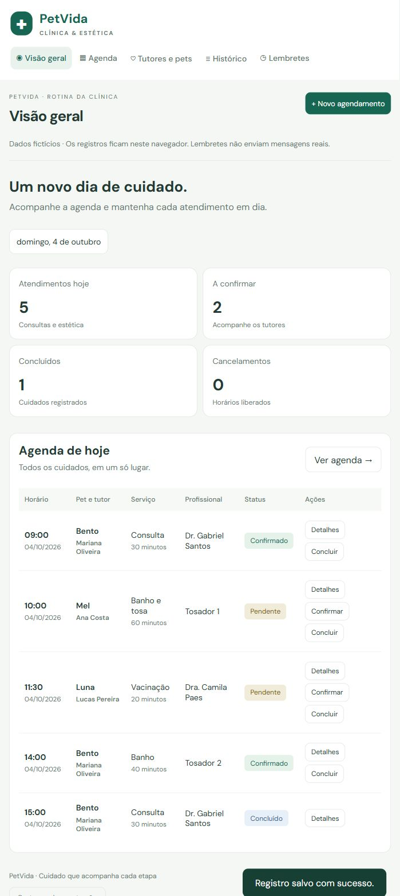
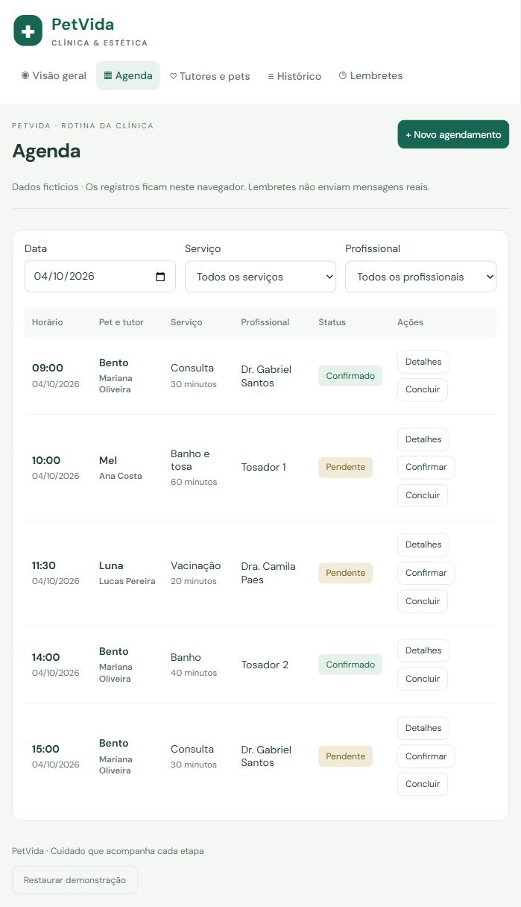
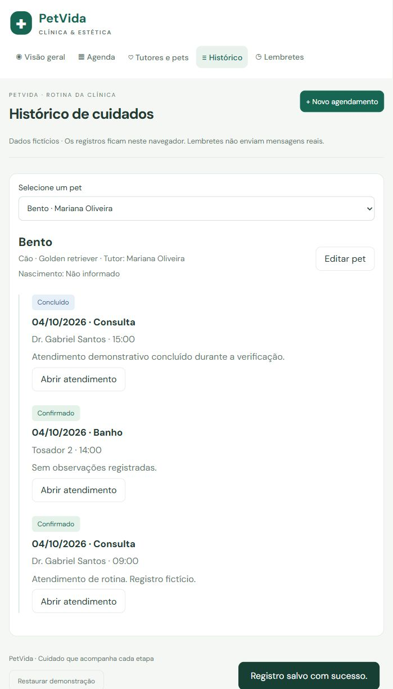

# PetVida Clínica e Estética Animal

Sistema web responsivo desenvolvido para o Estudo de Caso 5 da disciplina Design Profissional. O protótipo reúne agenda, tutores, pets e histórico para reduzir conflitos de horários e facilitar o acompanhamento dos atendimentos.

[Abrir aplicação publicada](https://paulogeandre.github.io/petvida-clinica/) · [Repositório do projeto](https://github.com/paulogeandre/petvida-clinica)

## Problema e solução

A clínica controla consultas e serviços de estética em uma agenda de papel e procura históricos em arquivos físicos. O crescimento da demanda gera sobreposição de horários, faltas e demora na recepção. A proposta é centralizar esses registros em uma interface operacional simples.

Um sistema web foi escolhido porque pode ser usado no computador da recepção e no navegador do celular, sem instalação de aplicativo. A agenda é o centro da experiência; o cadastro e o histórico mantêm o vínculo entre tutor, animal e atendimento.

## Funcionalidades

- Painel com indicadores calculados a partir dos atendimentos do dia.
- Agenda filtrada por data, serviço e profissional.
- Cadastro e edição de tutores e pets.
- Agendamentos com duração por serviço e bloqueio de sobreposição do mesmo profissional.
- Status pendente, confirmado, concluído, cancelado e falta.
- Histórico por pet com observações e data opcional de retorno.
- Prévia de lembretes com simulação explicitamente identificada.
- Persistência local no navegador e restauração dos exemplos com confirmação.

## Telas do protótipo

As capturas abaixo foram obtidas da aplicação funcionando durante a verificação. Incluem registros fictícios criados para testar os fluxos.

### Visão geral



### Agenda



### Histórico



### Navegação compacta


## Executar localmente

Requisito: Node.js 18 ou superior. Não é necessário instalar pacotes.

```sh
git clone https://github.com/paulogeandre/petvida-clinica.git
cd petvida-clinica
npm start
```

Abra http://127.0.0.1:4173 no navegador. Alternativamente, execute `node server.cjs`. O servidor é local e serve somente os arquivos públicos da aplicação. Não recebe ou salva dados de usuários.

## Testes

```sh
npm test
npm run check
```

Os oito testes verificam conflitos, horários adjacentes, profissionais distintos, liberação após cancelamento, edição do próprio registro, compatibilidade do serviço e expediente. A verificação no navegador cobriu criação de atendimento, bloqueio de conflito, cadastro de tutor e pet, persistência após recarregar, consulta ao histórico e simulação de lembretes.

## Arquitetura

```text
Interface HTML e CSS
        ↓
app.js — navegação, formulários e registros
        ↓
domain.js — serviços, profissionais e regras de agenda
        ↓
localStorage — dados apenas deste navegador
```

| Arquivo | Responsabilidade |
| --- | --- |
| index.html | Estrutura semântica e ponto de entrada |
| styles.css | Identidade visual e adaptação de layout |
| app.js | Telas, cadastros, histórico e persistência local |
| domain.js | Validação de agenda e dados de serviços |
| server.cjs | Servidor local sem dependências |
| tests/domain.test.cjs | Testes das regras de agendamento |
| docs/ | Briefing, mapa de telas, roteiro e capturas |

A fonte DM Sans é carregada pelo Google Fonts, com fallback para fontes do sistema. A aplicação continua funcional se a fonte externa não estiver disponível. Valores inseridos pelos usuários são escapados antes de aparecerem nas telas.

## Decisões do protótipo e limites

Todos os exemplos são fictícios. O horário das 08h às 18h, a duração dos serviços e os identificadores dos plantonistas e tosadores são escolhas demonstrativas; o enunciado não fornece esses detalhes. A validação considera o profissional, sem gestão de salas ou equipamentos.

Os dados ficam no localStorage, sem sincronização entre dispositivos. Limpar os dados do navegador remove os registros. Esta versão não possui autenticação, backend, controle de acesso, backup ou envio real de WhatsApp, SMS e e-mail. Não deve receber prontuários ou dados pessoais reais. Retornos preventivos usam somente a data preenchida pelo responsável, sem recomendação clínica automática.

Para uso real, a evolução prevista inclui autenticação por função, banco de dados compartilhado, registros de auditoria, backup e integração de mensagens com consentimento. A versão atual é um protótipo acadêmico funcional.

## Publicação no GitHub

O repositório público é [paulogeandre/petvida-clinica](https://github.com/paulogeandre/petvida-clinica). O projeto inclui o fluxo `.github/workflows/pages.yml`, que executa os testes e publica os arquivos públicos no GitHub Pages em pushes para `main` ou por execução manual. A fonte de publicação foi configurada como **GitHub Actions** em **Settings → Pages → Build and deployment**. O resultado das execuções pode ser consultado na [página de Actions](https://github.com/paulogeandre/petvida-clinica/actions).

Se preferir publicar manualmente, os arquivos necessários são `index.html`, `styles.css`, `app.js`, `domain.js` e `favicon.svg`. Não há etapa de build.

## Documentação da atividade

- [Briefing](docs/briefing.md)
- [Mapa de telas](docs/mapa-de-telas.md)
- [Roteiro de apresentação](docs/roteiro-de-apresentacao.md)

Fonte do caso: Estudo de Caso 5 Clínica PetVida e Estética Animal, fornecido na atividade. Prazo informado no enunciado: 05/10/2026 às 23h59.

## Licença

Código disponibilizado sob a licença [MIT](LICENSE).
